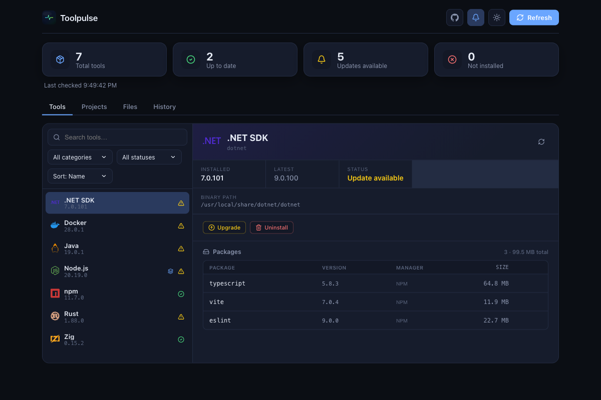
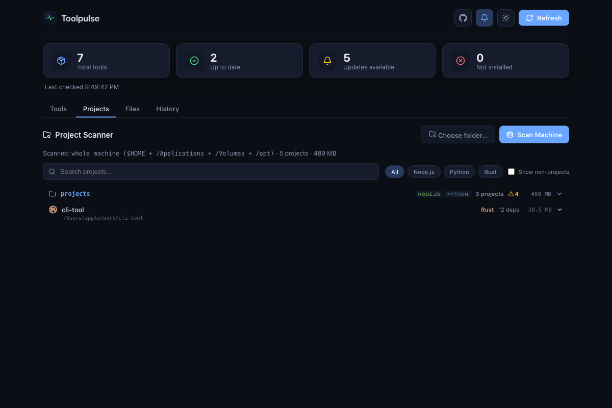
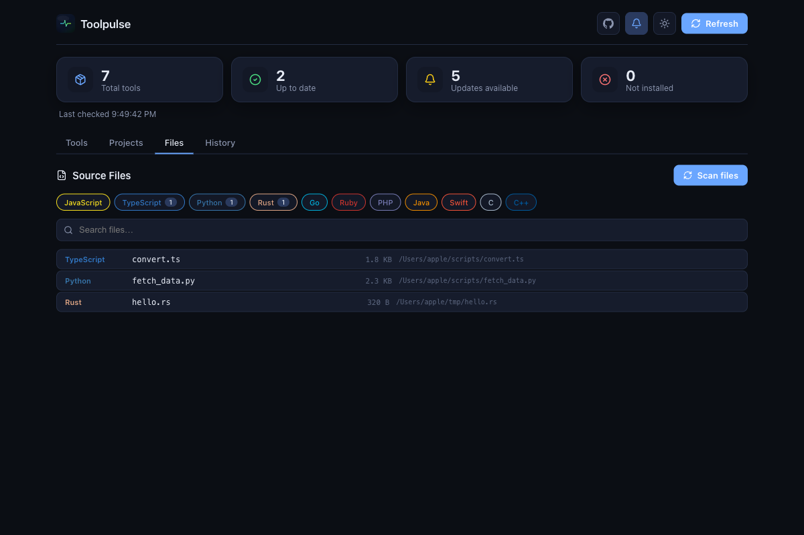

<div align="center">


# Toolpulse

### The desktop dashboard for every dev tool on your machine

[](https://github.com/mienetic/toolpulse/actions/workflows/ci.yml)
[](https://opensource.org/licenses/MIT)
[](#downloads)

Monitor, update, and manage **27+ development tools** — Node, npm, Bun, Deno, Python, pip, Rust, Cargo, Zig, Go, Swift, Ruby, .NET, Java, PHP, Docker, Homebrew, and more — all from one native app.

Built with **Tauri 2 + React + Rust**. Cross-platform, fast, and open-source.

</div>

---

## ✨ Features

### 🔍 Version monitoring
- **27+ tools** detected out of the box across 8 ecosystems
- **Latest-version lookup** against each tool's official API (Node dist index, GitHub releases, npm registry, …)
- **Outdated detection** with semver-aware comparison
- **macOS menu-bar tray** with live summary and per-tool version lines

### 📦 Multi-version support
- Detects **multiple installations** of the same tool (Homebrew / nvm / pyenv / system)
- Pick which installation to **track as default**

### ⚡ Install / uninstall / upgrade
- One-click **Install / Upgrade / Uninstall** for tools and global packages
- **Streaming terminal panel** with live command output + Cancel button
- **Confirmation dialog** before every system-mutating command
- **OS notification** on completion

### 🔔 Smart notification scheduler
- Configurable cadence: **every N hours**, **N times per day**, or **both**
- **Quiet hours** window (wraps midnight)
- **Dedupe** — won't notify twice about the same tool in one day

### 🗂️ Whole-machine project scanner
- Scans `$HOME` + common project locations for **8 ecosystems**
- **Tree view** grouped by directory structure
- **Dependency inspection** with outdated badges (Node)
- **On-disk size** per project and per package
- **Context menu**: open folder, open in IDE, open terminal, copy path, move to Trash
- **Auto-detects** installed editors (VS Code, Cursor, Zed, …)

### 📄 Standalone source-file scanner
- Finds **loose scripts** outside any project (`.py`, `.rs`, `.ts`, `.go`, …)
- Filter by **11 languages**
- Searchable list with file sizes

### 🔄 Auto-updater
- Checks GitHub releases on startup
- **One-click update** with progress notification

### 🐛 Error reporting
- Global **error boundary** catches crashes
- **"Report on GitHub"** button pre-fills an issue with stack trace + system info

---

## 📸 Screenshots

<div align="center">
<table>
<tr>
<td></td>
<td></td>
<td></td>
</tr>
</table>
</div>

---

## 🚀 Getting started

### Prerequisites
- [Node.js](https://nodejs.org/) 20+ (includes npm)
- [Rust](https://www.rust-lang.org/) stable — install with [rustup](https://rustup.rs/) and update with `rustup update stable`
- [Tauri 2 system dependencies](https://v2.tauri.app/start/prerequisites/) for your operating system

### Run in development
```bash
git clone https://github.com/mienetic/toolpulse.git
cd toolpulse
npm ci
npm run tauri dev
```

### Validate your changes
```bash
npx tsc --noEmit
cargo check --manifest-path src-tauri/Cargo.toml
```

### Build a production bundle
```bash
npm run tauri build
```

---

## 📥 Downloads

Pre-built binaries are available on the [**Releases**](https://github.com/mienetic/toolpulse/releases) page for:

| Platform | Download |
|----------|----------|
| macOS (Apple Silicon) | `.dmg` |
| macOS (Intel) | `.dmg` |
| Windows | `.msi` / `.exe` |

---

## 🏗️ Architecture

```
src-tauri/src/
├── lib.rs              # entry: state, plugins, tray, command registration
├── commands.rs         # #[tauri::command] — the IPC surface
├── runner.rs           # streaming command execution + notifications
├── scheduler.rs        # background notification scheduler
├── tray.rs             # macOS menu-bar tray icon
└── tools/
    ├── types.rs        # shared data types
    ├── registry.rs     # declarative tool definitions (27+ tools)
    ├── checker.rs      # run `tool --version`, detect multi-version
    ├── latest.rs       # fetch latest versions from public APIs
    ├── packages.rs     # enumerate global packages + sizes
    ├── projects.rs     # whole-machine project scanner (BFS)
    ├── source_files.rs # standalone source-file scanner
    ├── history.rs      # SQLite snapshot storage
    └── settings.rs     # settings + notification config

src/
├── App.tsx             # layout, tabs, updater, error boundary
├── components/         # Sidebar, DetailPanel, ProjectsView, FilesView, …
├── hooks/              # useTools, useProjectScan, useFileScan, useTerminalRun
└── lib/                # api wrappers, icons, tree builder
```

---

## 🤝 Contributing

Contributions are welcome! See [CONTRIBUTING.md](CONTRIBUTING.md) for guidelines.

- 🐛 [Report a bug](https://github.com/mienetic/toolpulse/issues/new?labels=bug)
- ✨ [Request a feature](https://github.com/mienetic/toolpulse/issues/new?labels=enhancement)
- 🔧 [Open a PR](https://github.com/mienetic/toolpulse/compare)

### Adding a new tool

Append a `ToolDefinition` to `builtin_tools()` in `src-tauri/src/tools/registry.rs` — no other code changes needed.

---

## ⚖️ License

[MIT](LICENSE) © Toolpulse Contributors
